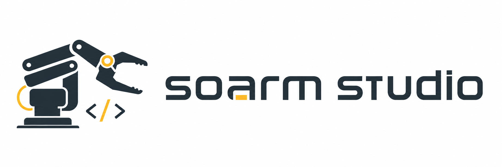

<p align="center">
  
</p>

# SOARM Studio

SOARM Studio is a thin application layer above `soarm-sdk` for dual-arm
hardware setup, calibration, teleoperation, and local LeRobot-v3-style data
recording.

The runtime path stays direct:

```text
leader arm -> teleop loop -> safety clipping -> follower arm
                         -> recorder -> LeRobot-v3-compatible files
```

## Documentation

The README is intentionally short. Detailed installation, architecture,
hardware setup, calibration, recording, and troubleshooting live in the docs
site:

- [SOARM Studio Docs](https://oooer8.github.io/soarm-studio/)

For local development, the same page lives at `docs/index.html`.

The docs site is designed for GitHub Pages and can later host images, videos,
code blocks, diagrams, and hardware walkthrough media under `docs/assets/`.

## Install

```bash
conda env create -f environment.yml
conda activate soarm-studio
```

The provided environment installs the local package and the sibling
`../soarm-sdk` SDK checkout in editable mode.

## Recommended Flow

```bash
soarm-studio scan --include-system
soarm-studio setup arms \
  --leader-port /dev/cu.usbmodemLEADER \
  --follower-port /dev/cu.usbmodemFOLLOWER \
  --base-arm-config ../soarm-sdk/configs/soarm.yaml
soarm-studio scan --preview-cameras --camera-indices 0,1,2,3 --backend avfoundation
soarm-studio setup cameras --backend avfoundation --wrist-index 1 --third-person-index 0
soarm-studio check --overwrite
soarm-studio calibrate --role leader
soarm-studio calibrate --role follower
soarm-studio teleop --free-test --seconds 5
soarm-studio record --episodes 1 --warmup 1 --seconds 10 --task "pick object" --overwrite
```

Generated machine-local files are ignored by git:

- `configs/session.yaml`
- `configs/arms/*.yaml`
- `previews/`
- `datasets/`

## Mock Smoke Test

```bash
soarm-studio check --config configs/sessions/mock.yaml --overwrite
soarm-studio teleop --config configs/sessions/mock.yaml --seconds 2
soarm-studio record --config configs/sessions/mock.yaml --seconds 2 --task "mock pick" --overwrite
soarm-studio dataset inspect datasets/mock-dual-soarm
soarm-studio dataset validate datasets/mock-dual-soarm
```

## Development

```bash
conda run -n soarm-studio python -m pytest
conda run -n soarm-studio python -m ruff check .
```

Keep SOARM Studio as the application layer. Low-level arm behavior, motion,
safety, and calibration remain delegated to `soarm-sdk`.
